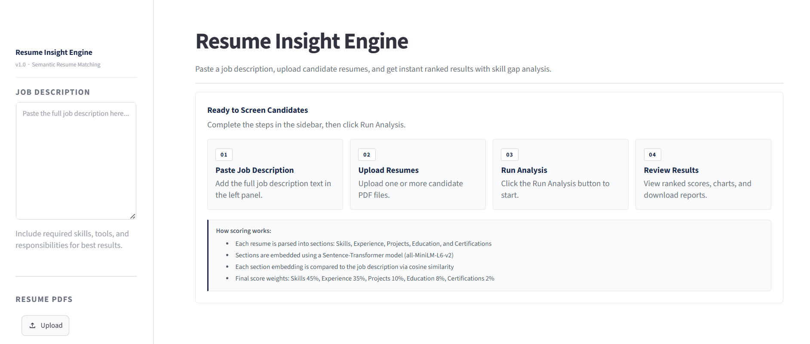
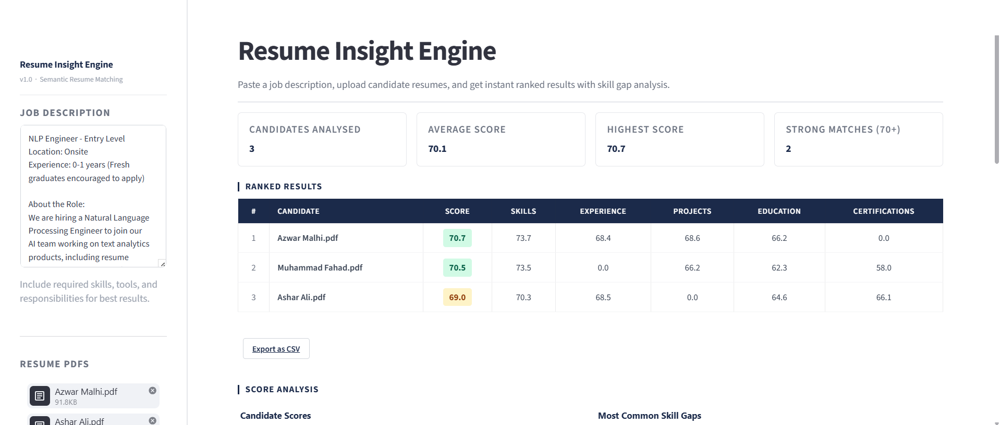
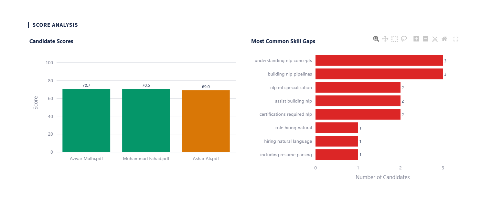
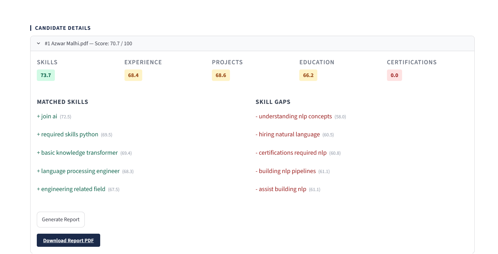

# Resume Insight Engine

A semantic resume screening application built with Streamlit. Paste a job description, upload candidate resumes in PDF format, and get instant ranked results with detailed skill gap analysis.

Live demo: https://resume-insight-engine.streamlit.app/

---

## Table of Contents

- [Features](#features)
- [Screenshots](#screenshots)
- [How It Works](#how-it-works)
- [Scoring Methodology](#scoring-methodology)
- [Technology Stack](#technology-stack)
- [Project Structure](#project-structure)
- [Prerequisites](#prerequisites)
- [Installation](#installation)
- [Running the Application](#running-the-application)
- [Usage Guide](#usage-guide)
- [Running Tests](#running-tests)
- [Deployment](#deployment)
- [Configuration](#configuration)
- [License](#license)

---

## Features

- **Job Description Analysis** -- Extracts key skills and requirements from any job description using KeyBERT
- **Multi-Resume Upload** -- Upload and analyse multiple candidate resumes simultaneously (PDF format)
- **Semantic Scoring** -- Computes per-section similarity scores using Sentence-Transformer embeddings
- **Ranked Results Table** -- Candidates ranked by weighted composite score with per-section breakdowns
- **Skill Gap Identification** -- Identifies matched skills (boosters) and missing skills (draggers) for each candidate
- **Interactive Charts** -- Visual bar charts for candidate comparison and most common skill gaps
- **PDF Report Generation** -- Generate downloadable single-page PDF reports for individual candidates
- **CSV Export** -- Export ranked results to CSV for further analysis
- **Weight Redistribution** -- Handles missing resume sections gracefully by redistributing weights

---

## Screenshots

**Landing page**

**Ranked results table**

**Score analysis and skill gap charts**

**Candidate detail view with matched skills and skill gaps**

---

## How It Works

1. **Paste a Job Description** -- The job description text is analysed to extract the most relevant keyphrases using KeyBERT with Maximal Marginal Relevance for diversity
2. **Upload Resume PDFs** -- Each resume is parsed from PDF using pdfplumber and split into canonical sections (Skills, Experience, Projects, Education, Certifications) via header keyword matching
3. **Embedding and Scoring** -- Both the job description and each resume section are embedded using the `all-MiniLM-L6-v2` Sentence-Transformer model. Cosine similarity between embeddings produces a 0-100 score per section
4. **Final Score Computation** -- Section scores are combined using weighted averaging. Missing sections have their weights redistributed across present sections
5. **Skill Attribution** -- Individual JD keywords are embedded and compared against the full resume embedding to identify the strongest matches (boosters) and weakest matches (draggers)

---

## Scoring Methodology

### Section Weights

| Section        | Weight |
|----------------|--------|
| Skills         | 45%    |
| Experience     | 35%    |
| Projects       | 10%    |
| Education      | 8%     |
| Certifications | 2%     |

### Score Ranges

| Range    | Classification |
|----------|----------------|
| 70 - 100 | Strong Match   |
| 50 - 69  | Moderate Match |
| 0 - 49   | Weak Match     |

### Weight Redistribution

When a section is not found in a resume (score of 0), its weight is redistributed proportionally across the remaining present sections. This prevents candidates from being unfairly penalised for resumes that do not include every section.

**Example:** If Certifications (2%) and Projects (10%) are missing, the remaining weights (Skills 45%, Experience 35%, Education 8% = 88% total) are each scaled by `1.0 / 0.88` so they sum to 100%.

---

## Technology Stack

| Component            | Technology                                               |
|----------------------|----------------------------------------------------------|
| Web Framework        | Streamlit                                                |
| PDF Parsing          | pdfplumber                                               |
| NLP (Section Split)  | spaCy (en_core_web_sm)                                   |
| Keyword Extraction   | KeyBERT                                                  |
| Sentence Embeddings  | sentence-transformers (all-MiniLM-L6-v2)                 |
| Scoring              | cosine similarity (NumPy)                                |
| Charts               | Plotly                                                   |
| PDF Reports          | fpdf2                                                    |
| Data Handling        | pandas                                                   |

---

## Project Structure
